

| GENESIS Learning Report – Module Name||
| :- | :- |

Learning Report – Applied System Development Life Cycle and Software Testing

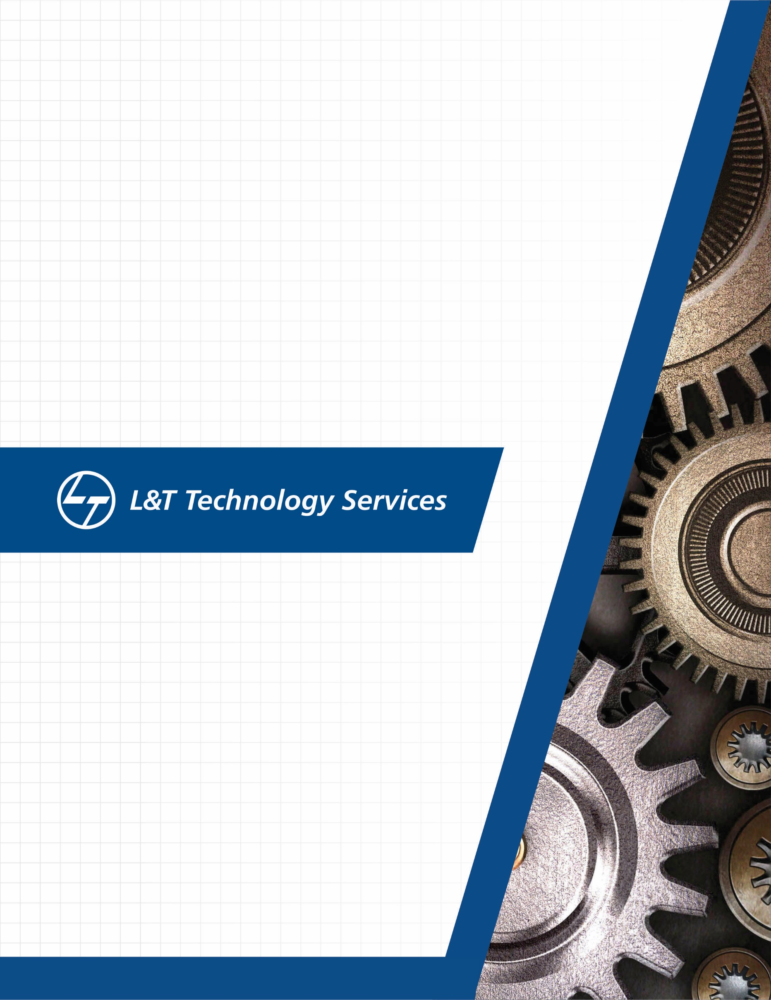yam./

|**Ver. Rel. No.**|**Release Date**|**Prepared. By** |**Reviewed By** |**To be approved By** |**Remarks/Revision Details**|
| :-: | :-: | :-: | :-: | :-: | :-: |
|1||Name/PS No|Name/PS No|Module Owner Name|Comments |
|2|04/03/2021|MANZAR HUSSAIN/99003654||||
|3|04/03/2021|AAKARSH MEHTA/99003608||||
|4|04/03/201|DIGENDRA    K. SAHU/99003709||||
|5|04/03/2021|YASH JHAJHARIA/99003616|||

|
|6|04/03/2021|OMPRAKASH HAROD/99003713||||
|7|04/03/2021|LALIT BHARDWAJ/99003706||||
|||||||
|||||||

**Document History**

**Table of Contents**

` `**TOC \F \O "1-9" \H[PERFORMANCE TRACKER	4**](#__REFHEADING___TOC2171_3397609625)**

[REQUIREMENT AND PLAN	4](#__RefHeading___Toc2173_3397609625)

[Need:	4](#__RefHeading___Toc2175_3397609625)

[*Introduction :	4*](#__RefHeading___Toc2177_3397609625)

[Feasibility Analysis	4](#__RefHeading___Toc2179_3397609625)

[*Market feasibility -:	4*](#__RefHeading___Toc2181_3397609625)

[*Technical feasibility -:	4*](#__RefHeading___Toc2183_3397609625)

[MY PRODUCT	4](#__RefHeading___Toc2185_3397609625)

[*High level requirement	4*](#__RefHeading___Toc2187_3397609625)

[*Low level requirement	5*](#__RefHeading___Toc2189_3397609625)

[SWOT:	5](#__RefHeading___Toc2191_3397609625)

[4 W's and 1 H-	6](#__RefHeading___Toc2193_3397609625)

[*What -	6*](#__RefHeading___Toc2195_3397609625)

[*Why-	6*](#__RefHeading___Toc2197_3397609625)

[*When-	6*](#__RefHeading___Toc2199_3397609625)

[Requirements (HL , LL) –	6](#__RefHeading___Toc2201_3397609625)

[*High Level Requirements:	6*](#__RefHeading___Toc2203_3397609625)

[*Low Level Requirements:	6*](#__RefHeading___Toc2205_3397609625)

[Planning	7](#__RefHeading___Toc2207_3397609625)

[**DESIGN AND ARCHITECTURE	8**](#__REFHEADING___TOC2209_3397609625)

[a. Structural -	8](#__RefHeading___Toc2211_3397609625)

[1. High level -	8](#__RefHeading___Toc2213_3397609625)

[2 . Behavioral :-	10](#__RefHeading___Toc2215_3397609625)

[a. High level :-	10](#__RefHeading___Toc2217_3397609625)

[b. Low Level -	11](#__RefHeading___Toc2219_3397609625)

[1. Faculty	11](#__RefHeading___Toc2221_3397609625)

[	11](#__RefHeading___Toc2223_3397609625)

[TEST PLAN	14](#__RefHeading___Toc866_3173328591)

**PERFORMANCE TRACKER**

**REQUIREMENT AND PLAN**

**Need:**

**Introduction :**

- Performance tracker is used to track the performance of trainees. It will keep track of modules and show the performance in the form of spider chart. 
- It will even provide the comparison between all modules and average of the whole class. 
- Main objective of the project is to keep track of the student's average and individual performance, so that it will be easy to understand which module needs the most focus. 

**Feasibility Analysis**

**Market feasibility -:**

- Performance tracker gives simple and user-friendly view of performance of individual trainee. 
- Trainees can improve performance in Training by using Performance tracker. 
- It can be used by any trainee who wants to keep track of there performance. 
- Spider chart will help students as well as faculty in order to understand the overall growth and performance of the class. 

**Technical feasibility -:**

- Making use of spider chart, which is effective chart for analysis the data of the student in order to calculate there individual and group performance. 
- Effective analysis of student growth by calculating Mean, Average and many more functionalities and there combinations. 
- Both students and faculty will be able to enhance there working performance by watching the growth. 
- Will provide strength and weakness of each and every individual so that learning can be personalized. 
- Will provide 5 bottom and top performer. 

**MY PRODUCT**

**High level requirement**

- Performance tracker will track score of 2 survey results and 2 test results. 
- Will be able to work with as many modules as we want. 
- Will give output in the form of spider chart for students. 
- Will have different functionalities (such as mean, average, top performers etc.), which can be used individually or combination of these features and functionalities can be used for effective result. 
- Will give output in form of tables and spider graph for faculty.
- UI will be user friendly.

**Low level requirement**

- Scores will be taken from pre survey, post survey, pre test and post test. 
- Each Individual will have own data of pre survey, post survey, pre test, post test in the form of spider chart. 
- Score range will be 0 to 10 
- Each student will have access to only his/her module and aggregate performance of the class. 
- Performance of the students will be divided into three parts, Top performers will get green flag student who failed will get red flags and average performance student will be marked as yellow flag. 
- Automated mail will be send to each and every faculty and students for continuous update regarding individual and class performance. 

**SWOT:**

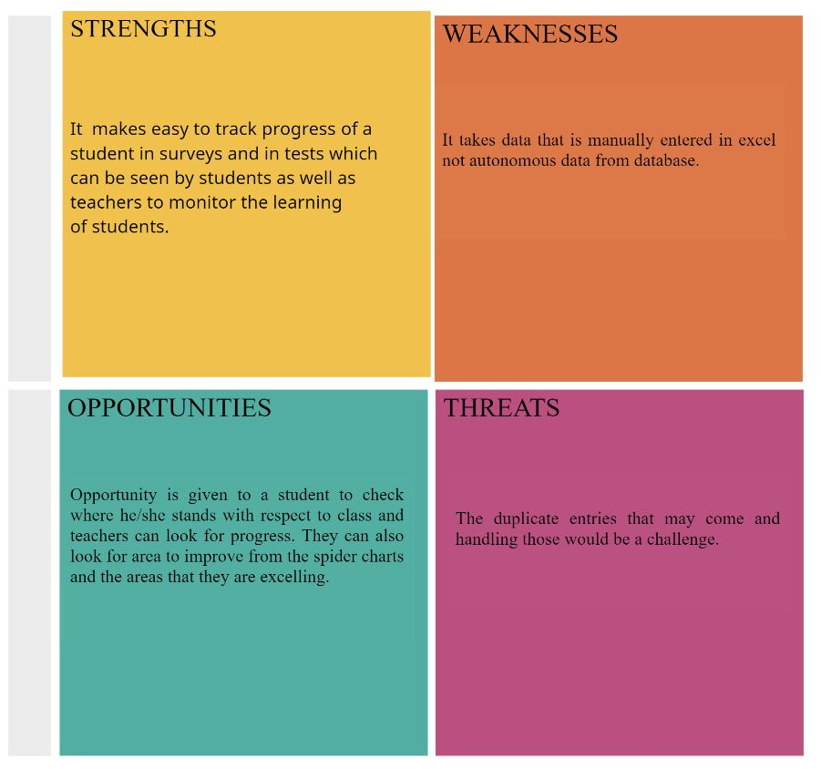

**4 W's and 1 H-**

**What -**

- Performance tracker is the measurement of student achievement across various academic modules.
- Teachers and education officials typically measure achievement using classroom performance, graduation rates and results from standardized tests.

**Why-**

- Continuous tracking of students' progress data helps teachers to make sure that the process of education works according to expectations with no delays or gaps.
- Having students see their growth and review how it relates to bigger goals increases student investment.

**When-**

- Monitoring of progress should occur after every weekly assessments for monitoring student's progress. 

**Where-** **-**

- Continuous tracking of students' progress data can be shown to both faculties as well as the students. But the faculty can access the data of complete class while the student can access only his/her data. 

**How-**

- The process also helps students internalize knowledge, turning what and how they learn into a well of resources they can use in the future. When students assess their own work, when they identify their own strengths and weaknesses, the likelihood that they will do better next time is greater. 

**Requirements (HL , LL) –**

**High Level Requirements:**

|**REQ\_ID**|**REQUIREMENTS**|**REQUIREMENT DESCRIPTION**|
| :-: | :-: | :-: |
|**HL\_1**|To track the score|It will track two survey results & two test results|
|**HL\_2**|Display overall result to the faculty|Faculty should be able to track progress at every step|
|**HL\_3**|Faculty should see min(), max(), top 5% score, bottom 5% score|Faculty should be able to access data based on the given functions|
|**HL\_4**|Module names are stated as LO\_1 to LO\_6|Module 1 is named as LO\_1 and so on and so forth|
**Low Level Requirements:**

|**REQ\_ID**|**REQUIREMENTS**|**REQUIREMENT DESCRIPTION**|
| :-: | :-: | :-: |
|**LL\_1**|The range of score is 0-10|The students will be marked from 0-10|
|**LL\_2**|Each excel file will have 3 input type|They are PS-No, Email Address and Result acquired by each one|
|**LL\_3**|Display aggregate result & topper's result of the class to the student|Student should be able to see their progress in a particular test along with topper's score to analyse.|
|**LL\_4**|Result in radar chart form|Student should be able to see the overall result in a radar chart format to analyse its overall performance|

Planning

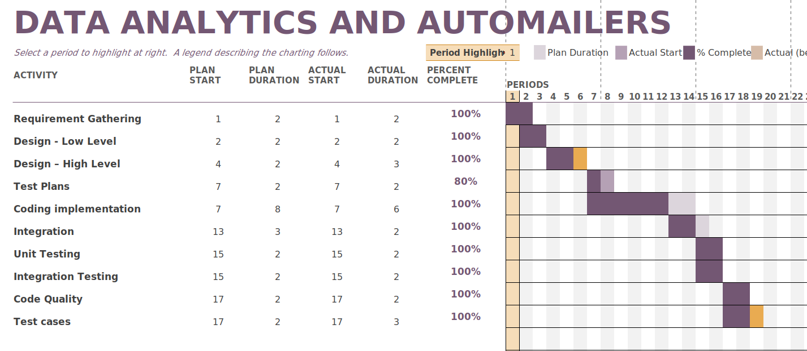			

**Design and Architecture**

**a. Structural -**

**1. High level -**

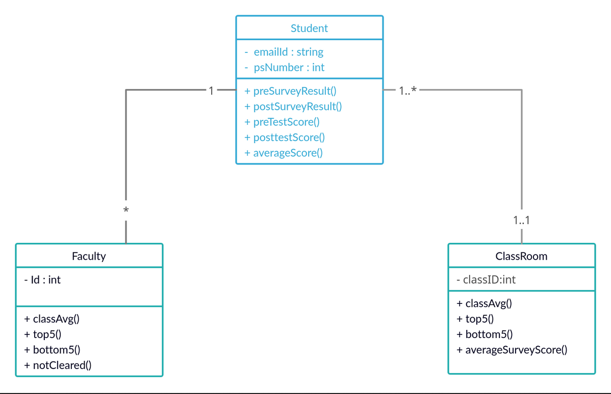

**2. Low level -**

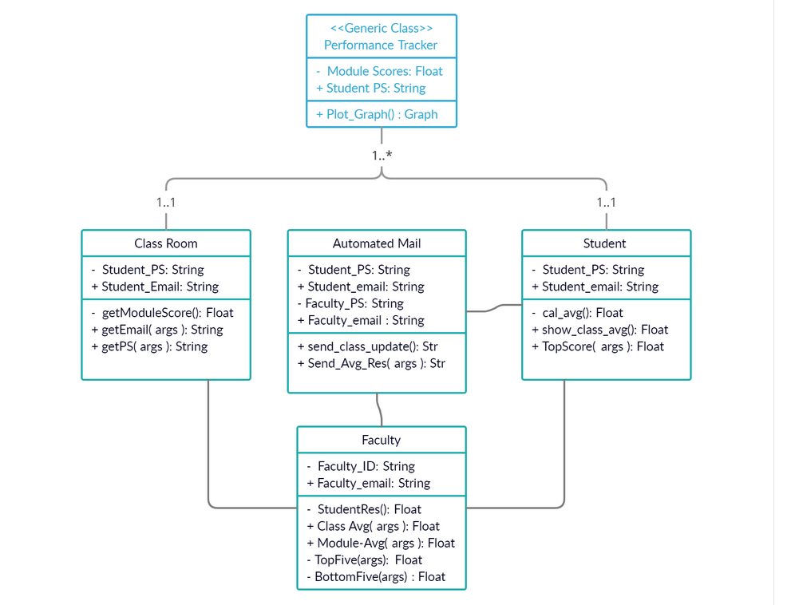**		

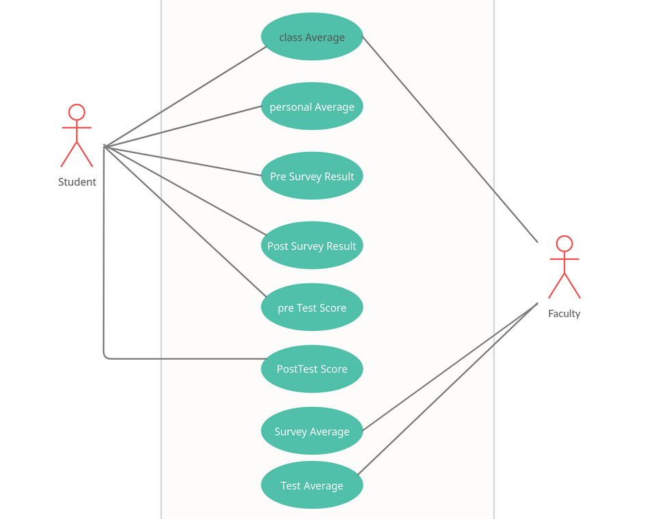**2 . Behavioral :-**

**a. High level :-**

**			

**b. Low Level -**

**1. Faculty**

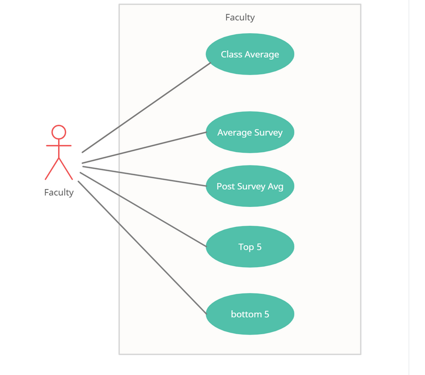**		

**2. Student**

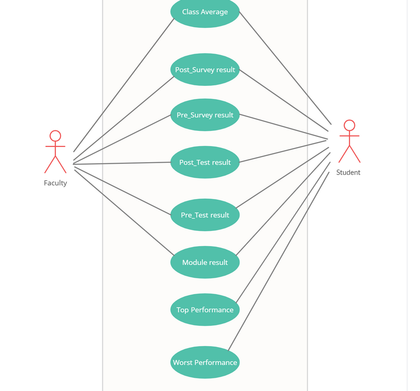**			

**3. Class Room**

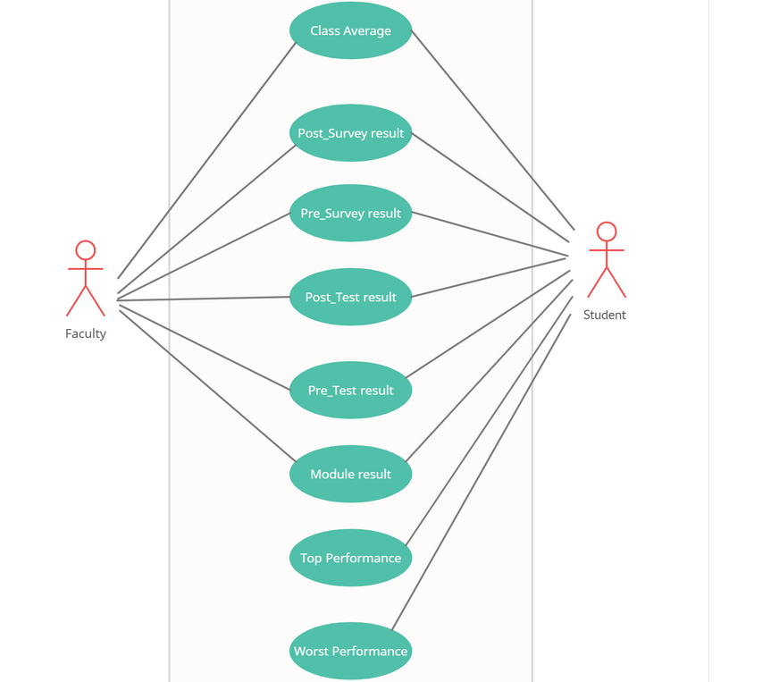**				

**TEST PLAN**

**HIGH LEVEL TEST PLAN**

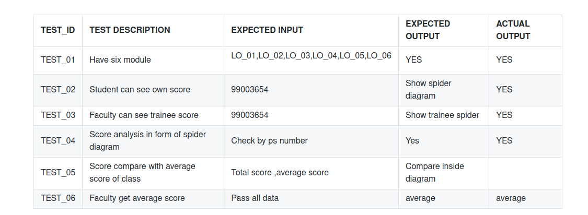

**	

**LOW LEVEL TEST PLAN**

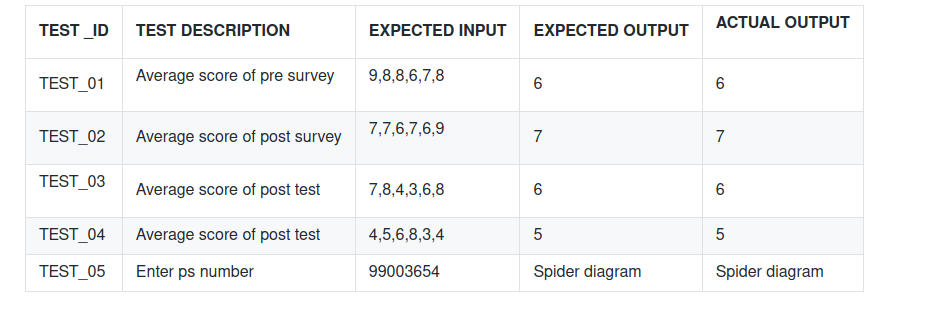

|**L&T Technology Services** |**CONFIDENTIAL**|          `     `**Page  PAGE 15 of  NUMPAGES 15**|
| :- | :- | :- |

